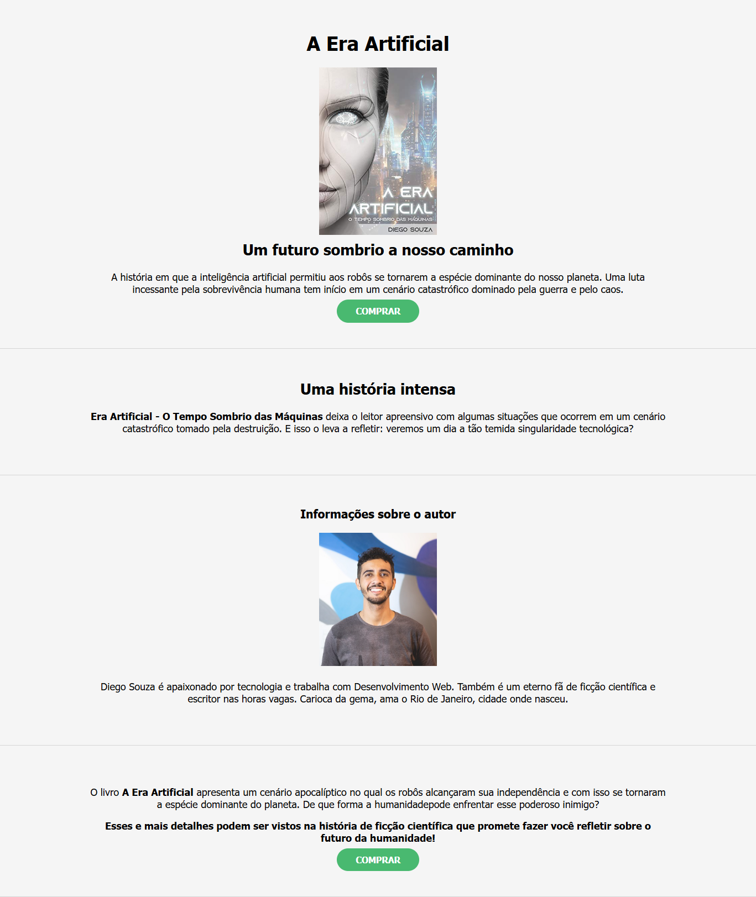

# 📖 A Era Artificial

Este é um projeto educacional desenvolvido com **HTML** e **CSS** que apresenta uma página estática para divulgação do livro *A Era Artificial*. O site tem como objetivo demonstrar a construção de uma página web simples, utilizando conceitos básicos de estruturação de conteúdo e estilização.

---

# 🔎 Preview do Projeto



## 🛠 Tecnologias Utilizadas

- **HTML5**: Para estruturar o conteúdo da página.  
- **CSS3**: Para estilizar e melhorar a aparência da página.  

---

## 📌 Funcionalidades

✔️ Página responsiva e estruturada com HTML e CSS.  
✔️ Uso de elementos semânticos para melhor organização.  
✔️ Seções separadas para apresentação do livro e do autor.  
✔️ Botões fictícios para compra do livro.  

---

## 🎨 Layout

A página contém:  
📌 **Capa do livro** com um breve resumo da história.  
📌 **Seção destacando o enredo** e os temas abordados.  
📌 **Informações sobre o autor** e sua relação com a tecnologia.  
📌 **Chamadas para ação**, incentivando a compra do livro.  

---

## 🔧 Como Executar o Projeto

1. Baixe ou clone este repositório:  
   ```bash
   git clone https://github.com/eilincoln/projeto-divulgacao-livro.git
   ```
2. Abra o arquivo `index.html` em qualquer navegador web.  

---

## 📂 Estrutura de Arquivos

```
/projeto-era-artificial
│── index.html
│── style.css
└── /img
    ├── capa-livro.jpg
    ├── autor.jpg
```

---

## 📜 Licença

Este projeto foi desenvolvido para fins educacionais e não possui uma licença específica.

---

Desenvolvido para aprendizado e prática de HTML e CSS. 😊
